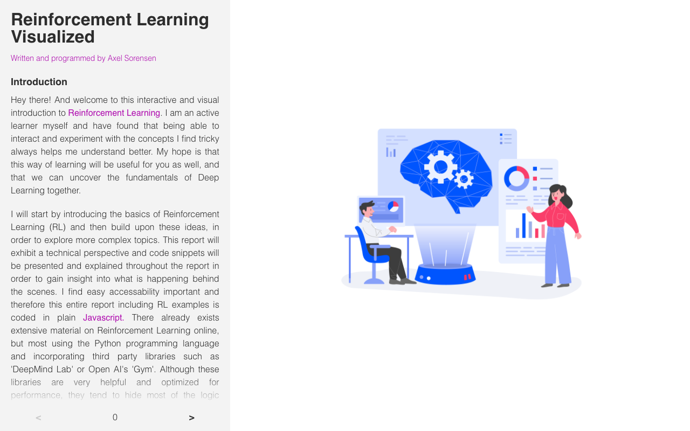

# 🤖 Reinforcement Learning Visualized

An interactive, page-by-page explainer of Deep Q-Learning with a live agent you can train and watch inside the browser.



## Features

- 📖 **Guided walkthrough** — a paginated explanation (with code snippets and equations) of how DQN works, page by page
- 🐟 **Live agent simulation** — a p5.js sketch runs an agent learning in real time as you read
- 🧠 **Real DQN implementation** — an actual JS deep Q-network agent (`DQN_Agent.js`) training and updating alongside the explanation, not just an animation
- 🎉 **Completion celebration** — a confetti explosion fires when you reach the final page

## Installation

```bash
git clone <this repo>
cd Reinforcement_Learning_Visualized
npm install
```

## Usage

```bash
npm run dev
```

Vite will print a local URL (default [http://localhost:5173](http://localhost:5173)). Use the arrows at the bottom to step through the pages; the agent trains live in the sketch on the right.

## Built with

- [React](https://reactjs.org/) 18 + [Vite](https://vitejs.dev/)
- [p5.js](https://p5js.org/) sketch for the environment/agent visualization
- [react-confetti-explosion](https://www.npmjs.com/package/react-confetti-explosion)

## Status

🔧 Was broken — `package.json` was missing three runtime dependencies (`react-p5`, `better-react-mathjax`, `react-syntax-highlighter`) actually imported by the source, causing Vite to fail resolving them at dev-server startup. Fixed by adding them to `dependencies`. Verified: `npm install && npm run dev` now serves cleanly at `http://localhost:5173/Reinforcement_Learning_Visualized/` (as of 2026-09-03). Finished as a self-contained explainer/demo — content and page count are hardcoded (20 pages), and there's no persistence of training progress between sessions.
